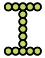

Homework for Day-01
---
bingol, 2022-07-25

## Warning
If you have experiencing problems with

- Installation of Visual Studio Code (VSC)
- Installation of Google Chrome (Chrome)
- Downloading files fromGoogle drive 

our TA **Melih Kamarat** will organize an office hours within the week and let you know. Please get in touch with him during office hours and let him help you to solve your problems.

Make sure that you do not have problems with these before the next lecture. Make also sure that you can make a change in a file in VSC and see the change in Chrome.


# What we covered
This week

- We install VSC and Google Chrome.
- We downloaded files from Google drive to a folder in our computer. 

- We practice to describe a path to a dummy, which will be our computer.
- We learn how to draw a circle in `z-1-circle.html`.

# To do
(Every student should do this part.)

1. Make sure that the directory structure in your disk is as given below.

	```
	2022-PrePlus
	|- Day-00
	|  |- Student info.md
	|  |- ...
	|- Day-01
	|  |- snap_0-2circle.html
	|  |- ...
	|- Day-02
	|- ...
	```

1. Keep playing the game on <https://www.google.com/doodles/celebrating-50-years-of-kids-coding?hl=en?>.
	- Think about how to develope such a game.
	- What kind of simple tools would you need in order to code such a game.

1. Play path description game with your friends. 
	- Try to make the description as necessary and sufficient as possible. 
	- Let them describe to you and you play the dummy one. 
	- Do your best to misunderstand the description as much as possibly. This is very important in order to understand how to program.


1. Make copies of `snap_0-2circle.html` and name them such as
`snap_0-2circle-01.html`,
`snap_0-2circle-02.html`.
	- In each copy change the numbers in the following lines:

	```js
	let bigCircle = s.circle(150, 150, 100);
	...
	let smallCircle = s.circle(100, 150, 70);
	```

	- Try to understand what happens when you change each one of them.
	
1. Consider the lines given below. 

	```js
        fill: "#bada55",
        stroke: "#000",
	```

	- Change `"#bada55"` ve `"#000"` with any 6-character combination, such as `"123456"`, `"ddccff"`, selected from the set 
`{0, 1, 2, ..., 9, a, b, c, d, e, f}`.
	- Try to understand the effect.
   


# Challenge
(This part is for advanced students.)

Now you can control your circles on the screen.


1.  you can write letters such as letter "I" below.

	

1. Similarly write letters "I", "L", "H" harflerini in files named as `letter_I.html`, `letter_L.html`, and `letter_H.html`.

1. Letters such as "A", "B", "O" are little bit more difficult to make but doable. Try.

1. Try to write your name using these letters.


# URL

- [Google drive repo](https://drive.google.com/drive/folders/1xyTDFbUJ1sMaST9bs9Aw50pKn6-ArjRp?usp=sharing)