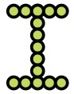

Homework for Day-01
---
bingol, 2022-02-15

## Uyari
- Visual Studio Code (VSC) kurulum
- Google Chrome (Chrome) lurulum
- Google drive dan dosya indirme 

ile sorun yasiyorsaniz dersin asistani **Melih Kamarat** bu hafta icinde bir gun size yardimci olacak. Bunun zamani size bildirilecek. 

Gelecek hafta bunlarda sorun yasamiyor hale gelmeniz onemli.
- VSC de bir html sayfasinda degisiklik yapip, bu degisikligi Chrome da gorebilir hale gelin.

# Yaptiklarimiz
Bu derste

- Visual Studio Code ve Google Chrome kurduk.
- Google drive dan dosyalari indirip kendi bilgisayarimizda actigimiz `2022-PrePlus` klasoru altinda actik.
- Aptal birisine yani bilgisayara yol tarif etmeyi denedik
- `snap_0-2circle.html` dosyasinda cember cizmeyi gorduk. 

# Yapilacaklar

1. Diskinizde asagidaki klasor yapisi oldugundan emin olun:

	```
	2022-PrePlus
	|- Day-00
	|  |- Student info.md
	|  |- ...
	|- Day-01
	|  |- snap_0-2circle.html
	|  |- ...
	|- Day-02
	|- ...
	```

1. <https://www.google.com/doodles/celebrating-50-years-of-kids-coding?hl=en?> adresindeki google oynunu oynayin.
	- Bu oyunu nasil kodlayabilirsiniz dusunun.
	- Ne cins temel araclara gereksiniminiz olabilir?

1. Arkadaslariniz ile derste kullandigimiz gibi yon tarifi oyunu oynayin. 
 	- Oyun dunyasini degistirip daha zor hale getirmek sizin elinizde. 
	- Tariflerinizi eksiksiz ne fazla ne eksik olarak yapmaya calisin. 
	- Arkadasinizin tarifini elinizden geldigince yanlis anlamaya calisin.


1. Bu dosyanin 
`snap_0-2circle-01.html`,
`snap_0-2circle-02.html` gibi kopyalarini yapin. Her kopyada

	```js
	let bigCircle = s.circle(150, 150, 100);
	...
	let smallCircle = s.circle(100, 150, 70);
	```

	kod satirlarinda sayilari degistirin. 
	Sayi degisince cizimde neyin degistigini anlamaya calisin.

1. Simdi de asagidaki satirda 

	```js
        fill: "#bada55",
        stroke: "#000",
	```
	`"#bada55"` ve `"#000"`yerine
	`"cccccc"`, `"ddccff"` gibi degerler girin. Ne oluyor?
	
	**Uyari:** Askinda `0, 1, 2, ..., 9, a, b, c, d, e, f` sembollerinden her hangi 6 adeti bir seye karsilik geliyor. Deneyin.
   


# Meydan okuma

Cemberleri istediginiz yere istediginiz buyuklukte cizebilirsiniz. 

1. Asagidaki gibi bir `I` harfi yapmayi deneyin.



1. Benzer sekilde "I", "L", "H" harflerini  `letter_I.html`, `letter_L.html`, and `letter_H.html` dosyalarinda yapin.

1. "A", "B", "O" harfleri biraz daha zor ama yapilabilir.

1. Bu harflerle kendi adinizi yazmaya calisin.


# Adresler
- Google drive adresi 
<https://drive.google.com/drive/folders/1Hc9sjt4a6tnNH4M5pLC_ffpqA41UWsAp?usp=sharing>